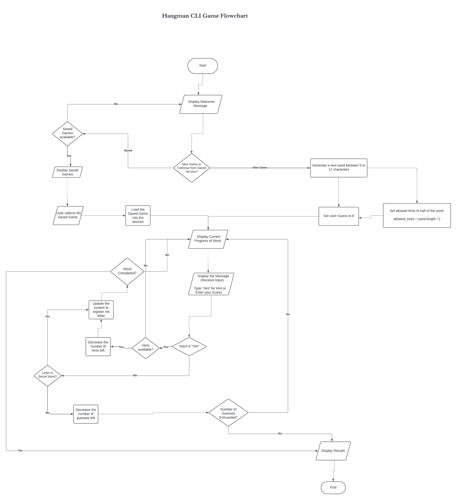

# Hangman Game

This is a Ruby implementation of the classic Hangman game. The game allows
players to guess letters to uncover a hidden word, with a limited number of
incorrect guesses allowed. The game also supports saving and loading game
states.

## Flow



## Features

- Start a new game or load a saved game
- Save the current game state
- Exit the game at any point
- Receive hints about the word
- Colorized output for better readability

## Installation

1. Clone the repository:
   ```sh
   git clone https://github.com/nanafox/hangman.git
   cd hangman
   ```

2. Install the required gems using Bundler:
   ```sh
   bundle install
   ```

## Usage

To start the game, run the following command:

```sh
ruby main.rb
```

### Game Controls

- To save the game at any point, type `:save`
- To exit the game at any point, type `:exit`
- To receive hints about the word, type `:hint`

## Code Structure

- `main.rb`: Entry point for the game.
- `lib/hangman.rb`: Contains the main `Hangman` class.
- `lib/game_helpers.rb`: Module with helper methods for the game.
- `lib/serializable.rb`: Module for serializing and deserializing game objects.
- `Gemfile`: Specifies the gem dependencies.

## Dependencies

- `msgpack` (~> 1.7)
- `colorize` (~> 1.1)

## Contributing

1. Fork the repository.
2. Create a new branch (`git checkout -b feature-branch`).
3. Make your changes.
4. Commit your changes (`git commit -am 'Add new feature'`).
5. Push to the branch (`git push origin feature-branch`).
6. Create a new Pull Request.
